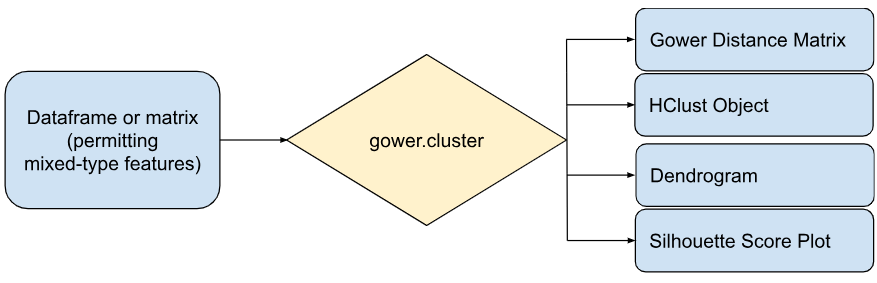

```{r, include = FALSE}
knitr::opts_chunk$set(
  collapse = TRUE,
  comment = "#>"
)
```


# Overview

The `gower.cluster` R package provides a simple, easy-to-use method for preparing mixed variable data for cluster analysis by employing Gower Distance. In addition, the package offers basic exploratory tools to propel the clustering of observations forward.

```{r setup, include=FALSE}
library(gower.cluster)
set.seed(121)
```

```{r, out.width='75%', fig.align='center', echo=FALSE}



```

*gower.cluster provides tools for exploratory cluster analysis including a hierarchical clustering object, dendrogram, and silhouette score plot with the corresponding optimal k value*


# Motivation for this package

For mixed variable data, i.e. when variables of different types (numerical, categorical, logical, etc.) are observed in a study, a rigorous representation of the dissimilarity between observations via distance measures is somewhat tedious. However, as can be seen at the core of hierarchical clustering (and specifically with Agglomerative clustering processes), distance matrices are useful for partitioning data points and subsequently aggregating them into clusters, with decreasing inter-cluster distances revealing increasing levels of similarity between observations (1). As a result, the package `gower.cluster` was developed in order to accommodate the challenge of measuring the dissimilarities observed in mixed variable data, and then apply the resulting distance measures in hierarchical clustering analysis. These main objectives are achieved under the following package capabilities:

* Configure a distance matrix of the observed data by applying Gower Distance—a distance metric developed to measure the dissimilarities observed in mixed variable data.
* Compute hierarchical clustering in R using the Gower Distance matrix under a user-specified agglomerative linkage method; return the hierarchical clustering object.
* Configure and return the dendrogram corresponding to the hierarchical clustering results to visualize clusters.
* Configure the silhouette score plot to help determine the optimal number of clusters (2). Also, output the corresponding optimal k value.

For more information concerning Gower Distance, package capabilities, and the development of the outputs, refer to More Background (below).


# Installation

The latest release of `gower.cluster` on github can be installed using the following code:
`devtools::install_github("aajb99/gower.cluster")`.


# Getting Started

After loading `gower.cluster`, you can proceed to test the main function of the package—`Gower_Cluster`—on data you intend to analyze via hierarchical clustering (whether it be mixed variable data, numerical data only, etc.). Let's take a look at an example to get things started:

We're going to create a simulation using synthetic data that includes all feature types handled by `gower.cluster`. According to the help file for `Gower_Cluster`, the package handles numeric, unordered categorical, ordered categorical, and logical feature types. We then construct the following example dataframe which contains these feature types:

```{r}

# Construct data features of differing types
# Logical
f_logic <- sample(c(0, 1), size = 80, replace = TRUE, prob = c(.5, .5))
# Numeric
f_numeric <- f_logic + sample(rnorm(80, sd = 0.5))
# Ordered categorical (i.e. ordinal)—assume 0 is low, 2 is high
f_cat_ordered <- ifelse(f_numeric < 0.15, 0, 
                        ifelse(f_numeric < 0.85, 1, 2))
# Unordered categorical (i.e. nominal)
f_cat_unordered <- sample(c(0, 1, 2, 3), size = 80, replace = TRUE, prob = c(.25, .25, .25, .25))

# Construct dataframe
example_df <- as.data.frame(cbind(f_logic, f_numeric, f_cat_ordered, f_cat_unordered))

```

Again referring to the help file, we find that to apply `Gower_Cluster`, there are required inputs along with optional inputs we can choose from to construct our Gower Distance matrix and run our hierarchical clustering analysis. We'll run through each input one at a time:

* `data.x`: Our dataset of interest. Make sure it is a dataframe object (or matrix object if you are testing numeric data only), otherwise you will get an error.
* `var.type.vec`: A px1 vector specifying the feature types corresponding to each feature. The input determines how each feature is treated in the Gower Distance computation. Numeric, unordered categorical, ordered categorical, and logical correpsond to 0, 1, 2, 3 respectively. In certain cases, if these specifications are mismatched the function may still run (e.g. inputting 0 instead of 1), so be cautious.
* `var.weight.vec`: Optional input. A px1 vector indicating weights applied to each feature in Gower Distance calculation (3). The entered weights are scaled to sum up to 1; say in this example, we would like `f_logic` to contribute twice as much relative to the other features—we can then input any weight values so long as `f_logic` has a value twice as large as each of the other weights (e.g. 10 compared to 5).
* `cluster.vis`: Optional input. A boolean input indicating whether we want to include clustering outputs. We want to proceed with our clustering analysis, so we input `TRUE` (note: the following three inputs must be specified if `cluster.vis` is true).
* `method`: Optional input (required when `cluster.vis` is true). A string input specifying our agglomerative method of choice (see help file for details). Here, say we decide to apply average linkage.
* `silhouette.kmin`: Optional input (required when `cluster.vis` is true). A value specifying the minimum k to be included in the silhouette score plot. In our example, we want to specify `silhouette.kmin=2` to explore the lowest possible k.
* `silhouette.kmax`: Optional input (required when `cluster.vis` is true). A value specifying the minimum k to be included in the silhouette score plot. In our example, we will specify `silhouette.kmax=30` to explore higher values of k.
* `ordered.cat.levels.vec`: Optional input (required when at least one ordered categorical feature is specified). A ex1 list containing e lists where e is the number of ordered categorical features specified (i.e. number of 2's in `var.type.vec`). Each list within `ordered.cat.levels.vec` must include ALL levels of the corresponding ordered categorical feature in ascending order. The first list corresponds to the first ordered categorical feature, etc. In our example, we have one such ordered categorical feature—its levels are 0-2, with 0 as the lowest level. Thus, we will specify `ordered.cat.levels.vec=list(list(0, 1, 2))` (note: `list` objects must be used or the function will return an error with incorrect dimensions).

Now that we have our desired inputs as discussed above, we can apply `Gower_Cluster`:

```{r}

# Apply Gower_Cluster
gower_cluster_output <- Gower_Cluster(data.x = example_df, var.type.vec = c(3, 0, 2, 1), var.weight.vec = c(10, 5, 5, 5), 
                                      cluster.vis = TRUE, method = 'average', silhouette.kmin = 2, silhouette.kmax = 30, 
                                      ordered.cat.levels.vec = list(list(0, 1, 2)))

# Display dendrogram, silhouette plot, and optimal k value outputs:
gower_cluster_output$dend.plot()
gower_cluster_output$silhouette.plot()
gower_cluster_output$optimal.k

```

The above outputs are simple and easy to implement/analyze from the RStudio environment. Also, note that in the case of larger dendrogram outputs, the Zoom tool under the Plots tab in RStudio improves visualization. Additionally, `gower_cluster_output$hclust.object$order` can be used to aid in determining the order of indices in the dendrogram if the dataset is large. Note: `gower_cluster_output$gower.mat` is another output included in `Gower_Cluster` not displayed above.


# More Background

The motivation behind the Gower Distance metric is to provide a distance measure observed between data points comprised of varying types of features (3). `Gower_Cluster` utilizes [`gower.dist`](https://www.rdocumentation.org/packages/StatMatch/versions/1.4.1/topics/gower.dist) from the `StatMatch` package, which is capable of computing a distance matrix containing dissimilarity coefficients $d(i,j)$ between the $i^{th}$ and $j^{th}$ observations. Overall, these coefficients can be described as a "weighted sum" of dissimilarities computed per feature ($d_{ijk}$ for the $k^{th}$ feature), where the method in which each $d_{ijk}$ is compute depends on the feature type (3).

In addition to the `gower.dist` function, `Gower_Cluster` utilizes other R tools like [`hclust`](https://www.rdocumentation.org/packages/stats/versions/3.6.2/topics/hclust) from the `stats` package to help construct the hierarchical clustering output objects, as well as packages like [`dendextend`](https://cran.r-project.org/web/packages/dendextend/vignettes/dendextend.html), [`cluster`](https://cran.r-project.org/web/packages/cluster/index.html), [`knitr`](https://yihui.org/knitr/), and [`rmarkdown`](https://rmarkdown.rstudio.com/docs/index.html).


## Links

[`Source code and license`](https://github.com/aajb99/gower.cluster)


## Developers

Author, maintainer:

[`Aaron Brown (personal info/blog)`](https://aajb99.github.io/)


## References

1. Müllner, D. (2011). Modern Hierarchical, Agglomerative Clustering Algorithms, 12.  https://doi.org/10.48550/arXiv.1109.2378 

2. Evaluate clustering solution using silhouette criterion. MathWorks. (2024). https://www.mathworks.com/help/stats/clustering.evaluation.silhouetteevaluation.html 

3. gower.dist: Computes the Gower’s distance. RDocumentation. (n.d.). Retrieved from https:
//www.rdocumentation.org/packages/StatMatch/versions/1.4.1/topics/gower.dist


